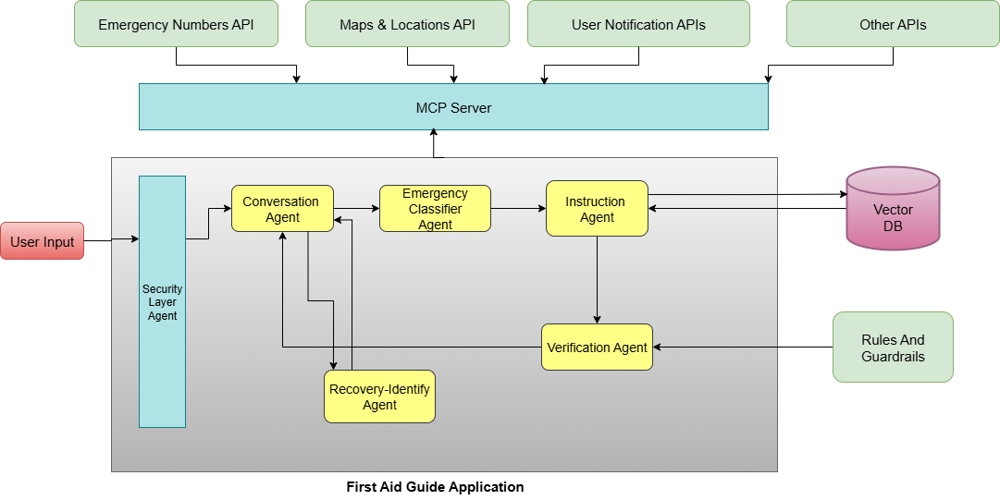

# 🩹First Aid Guide – Multi-Agent Assistant

The First Aid Guide is a proof-of-concept safety assistant that pairs a FastAPI
multi-agent pipeline with a React chat client. The system triages emergency
messages, generates numbered first-aid instructions, and enforces safety
guardrails so that users always receive conservative, policy-compliant advice.

## Table of contents
- [Overview](#overview)
- [Features](#Features)
- [AI-Agents](#AI-Agents)
- [Key capabilities](#key-capabilities)
- [System architecture](#system-architecture)
  - [Backend pipeline](#backend-pipeline)
  - [Frontend experience](#frontend-experience)
- [Technology stack](#technology-stack)
- [Project structure](#project-structure)
- [Getting started](#getting-started)
  - [Prerequisites](#prerequisites)
  - [Run with Docker Compose](#run-with-docker-compose)
  - [Run services manually](#run-services-manually)
- [Environment configuration](#environment-configuration)
- [Development workflow](#development-workflow)
- [API surface](#api-surface)
- [Additional resources](#additional-resources)
- [Future Enhancements](#Future-Enhancements)


## Overview

At a high level, the application exposes two public surfaces:

1. A **FastAPI backend** (`backend/app`) that orchestrates multiple LLM-backed
   agents and supporting services (vector search, guardrails, tool adapters) to
   analyze user intent and produce safe first-aid guidance.
2. A **Vite + React frontend** (`frontend/src`) that renders a chat interface,
   streams conversation history, and displays references returned by the
   backend.

The services can be launched together with Docker Compose or run individually
for iterative development.

## 🚀Features

- 🧠 Conversational AI Agent for natural language emergency diagnosis
- 📍 Google Maps Integration – locate nearest hospitals or emergency services
- 🎥 YouTube Video Embeds – show visual first-aid guides
- 🗄️ Vector Database (AstraDB) for contextual memory
- 🧩 Multi-Agent Design – specialized AI agents (Emergency Classifier, Recovery, Security, Conversational, Secuirity, Instruction)
- 🌐 FastAPI Backend & React Frontend (Vite)
- 🐳 Docker Compose for easy deployment

## 🤖 AI-Agents

| Agent                    | Purpose                                                                                                                                      |
| ------------------------ | -------------------------------------------------------------------------------------------------------------------------------------------- |
| **Conversational Agent** | Handles general conversation, triage, and small-talk context.                                                                                |
| **Instruction Agent**    | Generates detailed, step-by-step first-aid procedures for the detected condition. Works closely with the Conversational and Recovery Agents. |
| **Emergency Classifier** | Detects and classifies the type of emergency (e.g., bleeding, burn, CPR needed).                                                             |
| **Recovery Agent**       | Provides recovery and post-care guidance after immediate intervention.                                                                       |
| **Security Agent**       | Monitors user inputs, prevents malicious requests, and enforces API safety limits.                                                           |


## 🌟Key capabilities

- **Automated triage** – Classifies incoming messages by incident type and
  severity to tailor the response and highlight critical scenarios.
- **Retrieval-augmented guidance** – Retrieves grounding documents from Astra DB
  (when configured) before generating multi-step instructions via LLMs.
- **Policy guardrails** – Applies YAML-driven allow/deny rules and post-response
  verification to avoid disallowed medical claims.
- **Mocked MCP tools** – Simulates calls for emergency numbers and map hints so
  that a real MCP server can be added later without changing the pipeline.
- **Minimal chat UI** – React client that maintains conversation state and
  interacts with the backend through Axios helpers.

## 👷🏻‍♂System architecture



The backend is responsible for message triage, instruction generation, and risk
scoring, while the frontend displays the structured assistant output in a chat
format. Both services communicate over REST.

### 🛠️Backend pipeline

The FastAPI application (`backend/app/main.py`) exposes `/api/chat` and
`/api/chat/continue`. Both routes delegate to the orchestrator in
`agents/conversational_agent.py`, which performs the following steps:

1. **Security pass** – `security_agent.protect` sanitizes free-form text and
   removes disallowed topics before further processing.
2. **Emergency triage** – `emergency_classifier.classify` labels the incident
   category, severity, and relevant keywords, falling back to safe defaults when
   external providers fail.
3. **Tool enrichment** – `services.mcp_server` returns emergency contacts and a
   maps hint, mimicking MCP tool calls so the response can reference them.
4. **Instruction generation** – `instruction_agent.generate_instructions`
   performs retrieval-augmented generation with Astra DB similarity search and
   Groq/OpenAI chat models (when credentials are available).
5. **Verification and guardrails** – `verification_agent.verify` and
   `services.rules_guardrails` ensure the final guidance complies with the YAML
   policy file.
6. **Risk scoring & assembly** – `services.risk_confidence.score_risk_confidence`
   aggregates severity and guardrail outcomes to estimate the confidence of the
   response before returning a structured payload.

Auxiliary services such as `services.vector_db` and `config.py` encapsulate
provider configuration, error handling, and feature toggles.

### 💻Frontend experience

The React client centers around `src/components/ChatUI.tsx`, which stores the
conversation log and loading state. `src/api.ts` wraps Axios calls to the
backend. `App.tsx` renders the chat UI, while `main.tsx` mounts the application
through Vite. The default development proxy forwards `/api` calls to whichever
backend host is specified via `VITE_PROXY_TARGET`.

## 🖲️Technology stack

| Layer        | Technologies |
| ------------ | ------------ |
| Backend      | Python 3.11, FastAPI, Uvicorn, Pydantic, Requests, PyYAML |
| Agents       | LLM providers (Groq/OpenAI via API keys), Astra DB Data API |
| Frontend     | React 18, TypeScript, Vite, Axios |
| Tooling      | Docker, Docker Compose |

## Project structure

```
first-aid-test/
├── backend/              # FastAPI + agent pipeline
│   ├── app/
│   │   ├── agents/       # Security, triage, instruction, verification, recovery
│   │   ├── services/     # Guardrails, MCP tools, vector database, risk scoring
│   │   ├── config.py     # Environment + feature flag helpers
│   │   ├── main.py       # HTTP routes delegating to the orchestrator
│   │   └── utils.py      # Shared sanitization and keyword helpers
├── frontend/             # React chat client (Vite)
│   ├── src/
│   │   ├── api.ts        # Axios wrappers for chat endpoints
│   │   ├── components/   # Chat UI widgets
│   │   ├── App.tsx       # Top-level UI composition
│   │   └── main.tsx      # App bootstrap
├── docs/                 # Architecture and deep-dive references
└── docker-compose.yml    # Local orchestration for frontend + backend
```

### Prerequisites

- Docker and Docker Compose **or**
- Node.js 18+, npm, and Python 3.11 if running services manually
- (Optional) Astra DB account and API keys for retrieval-augmented generation
- (Optional) OpenAI or Groq API keys for LLM-powered agents

### Run with Docker Compose

```bash
docker compose up --build
```
## Environment configuration

Copy `.env.example` (if present) or create a `.env` file in the backend folder
to supply credentials and feature flags:

- `OPENAI_API_KEY`, `GROQ_API_KEY` – enable hosted LLM providers
- `ASTRA_DB_APPLICATION_TOKEN`, `ASTRA_DB_ID`, `ASTRA_DB_REGION` – enable
  retrieval with Astra DB
- `EMBEDDING_PROVIDER` – select the embedding backend (`openai`, `groq`, or
  `none`)
- `ENABLE_GUARDRAILS` – toggle YAML policy enforcement

Environment variables are read by `backend/app/config.py` and can be overridden
at runtime.

## Development workflow

- **Backend linting/tests** – Add unit tests under `backend/app/tests` (not yet
  populated) and run them with `pytest`.
- **Hot reload** – Use `uvicorn --reload` and Vite's `npm run dev` for live
  reload during development.
- **Code organization** – Each agent resides in `backend/app/agents` and should
  remain single-purpose. Shared utilities live under `backend/app/services` and
  `backend/app/utils.py`.
- **Documentation** – Keep architectural updates synchronized with the docs in
  [`docs/`](docs/), especially `ARCHITECTURE.md`.

## API surface

| Method | Endpoint              | Description                                   |
| ------ | --------------------- | --------------------------------------------- |
| POST   | `/api/chat`           | Runs the pipeline and returns the raw agent
|        |                       | payload, including triage metadata.           |
| POST   | `/api/chat/continue`  | Returns the agent payload plus a synthesized
|        |                       | assistant message suitable for UI rendering.  |
| GET    | `/api/health`         | Lightweight health check for uptime probes.   |

Refer to the autogenerated docs at `/docs` for request/response schemas.

## Additional resources

- [docs/ARCHITECTURE.md](docs/ARCHITECTURE.md) – In-depth backend and frontend
  walkthroughs, including service interactions and future improvements.
- [docs/BACKEND_FRONTEND_FILE_REFERENCE.md](docs/BACKEND_FRONTEND_FILE_REFERENCE.md) –
  File-by-file explanations for both services.

## 💡Future Enhancements

 - Voice-based interaction
 - Offline emergency mode (PWA)
 - Integration with wearable sensors
 - Automated incident reporting
